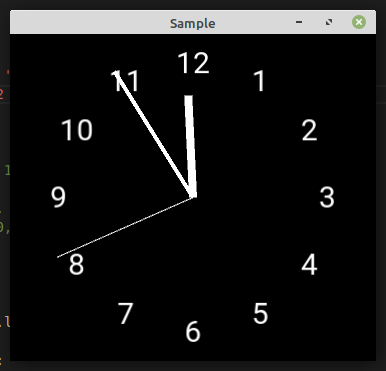
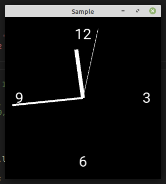
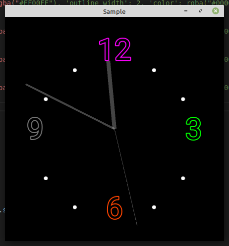
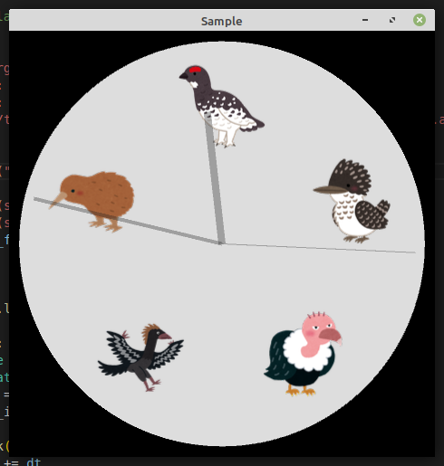

# KXAnalogClock

A lightweight analog clock made with one widget.

```yaml
KXAnalogClock:
    labels:
        (
        {'text': text, 'font_size': 30, }
        for text in "12 1 2 3 4 5 6 7 8 9 10 11".split()
        )
```



```yaml
KXAnalogClock:
    labels:
        (
        {'text': text, 'font_size': 30, }
        for text in "12 3 6 9".split()
        )
```



```yaml
KXAnalogClock:
    hours_hand_color: rgba("#FFFFFF44")
    minutes_hand_color: rgba("#FFFFFF44")
    seconds_hand_color: rgba("#FFFFFF44")
    labels:
        (
        {'text': '12', 'font_size': 60, 'outline_color': rgba("#FF00FF"), 'outline_width': 2, 'color': rgba("#000000"), },
        {'text': '.', 'font_size': 70, },
        {'text': '.', 'font_size': 70, },
        {'text': '3', 'font_size': 60, 'outline_color': rgba("#00FF00"), 'outline_width': 2, 'color': rgba("#000000"), },
        {'text': '.', 'font_size': 70, },
        {'text': '.', 'font_size': 70, },
        {'text': '6', 'font_size': 60, 'outline_color': rgba("#FF4400"), 'outline_width': 2, 'color': rgba("#000000"), },
        {'text': '.', 'font_size': 70, },
        {'text': '.', 'font_size': 70, },
        {'text': '9', 'font_size': 60, 'outline_color': rgba("#777777"), 'outline_width': 2, 'color': rgba("#000000"), },
        {'text': '.', 'font_size': 70, },
        {'text': '.', 'font_size': 70, },
        )
```



```yaml
#:import Atlas kivy.atlas.Atlas

KXAnalogClock:
    hours_hand_color: rgba("#22222255")
    minutes_hand_color: rgba("#22222255")
    seconds_hand_color: rgba("#22222255")
    textures: Atlas("bird.atlas").textures.values()
    canvas.before:
        Color:
            rgba: rgba("#DDDDDD")
        Ellipse:
            pos: (-min(self.size) / 2.1, ) * 2
            size: (min(self.size) / 2.1 * 2., ) * 2
```




## Installation

```
pip install git+https://github.com/gottadiveintopython/kivyx.uix.analogclock#egg=kivyx.uix.analogclock
```

## LICENSE

- The image inside the example directory is under [いらすとや](https://www.irasutoya.com/)'s license.
- Everything else is under MIT license.

## Tested on

- CPython3.8.12 + Kivy2.1.0
